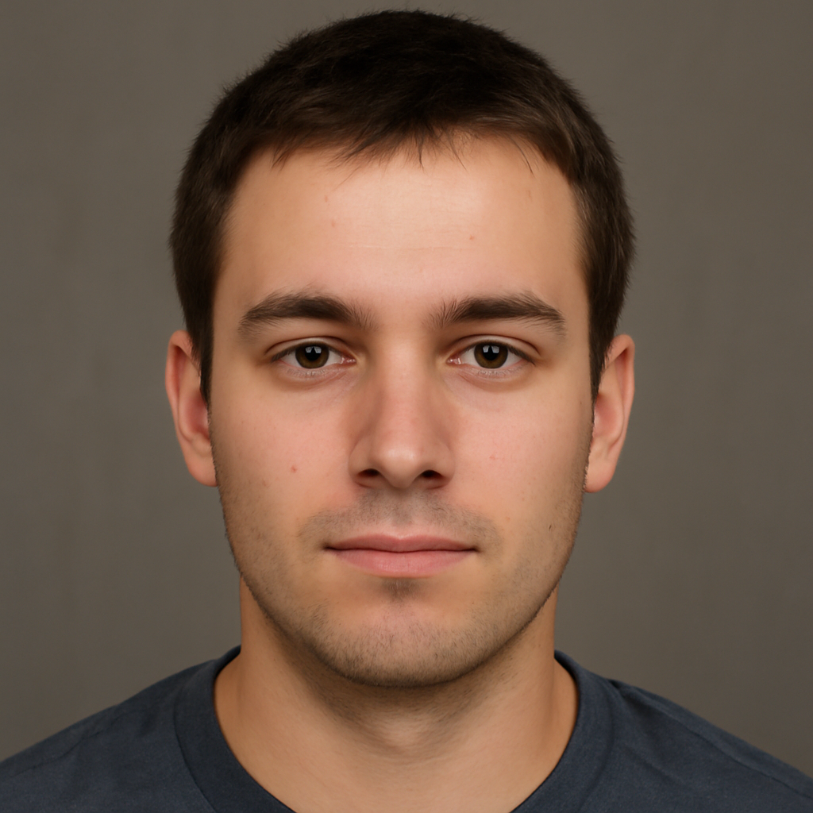
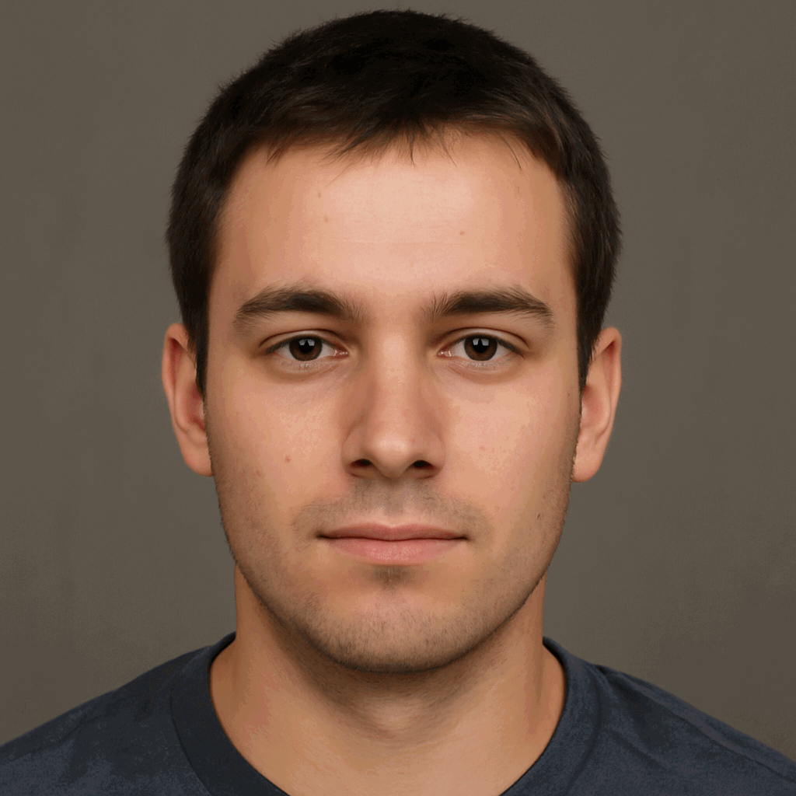

# ImgItr - Image Iteration Tool

ImgItr is a command-line tool that uses OpenAI's Image GPT to iteratively process images, creating sequences of evolved images and compiling them into animated GIFs.

## Why?

I saw this [Reddit thread](https://old.reddit.com/r/ChatGPT/comments/1k9yow9/chatgpt_omni_prompted_to_create_the_exact_replica/) and wanted a way to generate similar images.

## Example

### Input Image
_Input image was AI generated_


### Output


`bun src/index.ts generate input/fake.png 10`

### Output with custom prompt

`bun src/index.ts generate input/fake.png 10 --prompt="Make this person look 1 year older but otherwise identical"`

## Features

- **Generate Mode**: Takes an input image and iteratively processes it through OpenAI's Image GPT, creating a sequence of images that evolve from the original.
- **GIF Creation Mode**: Takes a directory of existing PNG images and compiles them into an animated GIF. [For testing/development]

## Prerequisites

- [Bun](https://bun.sh/) runtime environment
- OpenAI API key

## Installation

1. Clone this repository:
   ```bash
   git clone https://github.com/joshstrange/imgitr.git
   cd imgitr
   ```

2. Install dependencies:
   ```bash
   bun install
   ```

3. Set your OpenAI API key as an environment variable:
   ```bash
   export OPENAI_API_KEY=your_openai_api_key_here
   ```

## Usage

### Generate Mode

Takes an input image and iteratively processes it through OpenAI's Image GPT. Each iteration can take up to a minute.

```bash
bun src/index.ts generate <input_image_path> <iterations> [options]
```

Parameters:
- `<input_image_path>`: Path to the input image to start the generation from
- `<iterations>`: Number of iterations to perform

Options:
- `--prompt <prompt>`: Custom prompt to use for image generation (default: "Create the exact replica of this image, don't change a thing.")
- `--delay <delay>`: Delay between frames in milliseconds for the generated GIF (default: 500)

Requirements:
- Input image must be square
- Input image dimensions must be ≤ 1024x1024
- OpenAI API key must be set as an environment variable

Example:
```bash
bun src/index.ts generate input/my-image.png 5
```

### GIF Creation Mode

[For development/testing]
Takes a directory of existing PNG images and compiles them into an animated GIF:

```bash
bun src/index.ts gif <directory_path> [options]
```

Parameters:
- `<directory_path>`: Path to the directory containing PNG images to be used as frames

Options:
- `--delay <delay>`: Delay between frames in milliseconds for the generated GIF (default: 500)

Example:
```bash
bun src/index.ts gif generated/20250430-123400-5otqi2
```

## Output

All generated content is saved in the `generated` directory:
- For Generate Mode, a new subdirectory is created with a timestamp and random string
- Each iteration is saved as a numbered PNG file
- The final animated GIF is saved in the same directory as `animation.gif`
- For GIF Creation Mode, the GIF is saved directly in the `generated` directory

## Notes

- The delay between frames in the generated GIFs can be customized using the `--delay` option (default: 500ms)
- The prompt used for image generation can be customized using the `--prompt` option
- PNG files in directories are sorted alphabetically when creating GIFs
